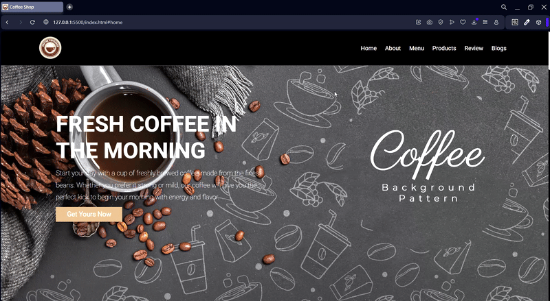

# ☕ Coffee Shop 

Bu proje, HTML, CSS ve JavaScript kullanılarak geliştirilmiş mobil uyumlu bir kahve dükkanı web sitesidir. Ziyaretçilere menü, ürünler, blog yazıları, kullanıcı yorumları ve iletişim gibi içerikleri sunar.

---

## 🚀 Özellikler

- Responsive tasarım 
- Statik Menü Bölümü
- Grid Yapısı
- 📱 **Temel JavaScript etkileşimleri**

---

## 🛠️ Kullanılan Teknolojiler

- HTML5

- CSS3

- JavaScript 

## 📸 Ekran Kaydı

